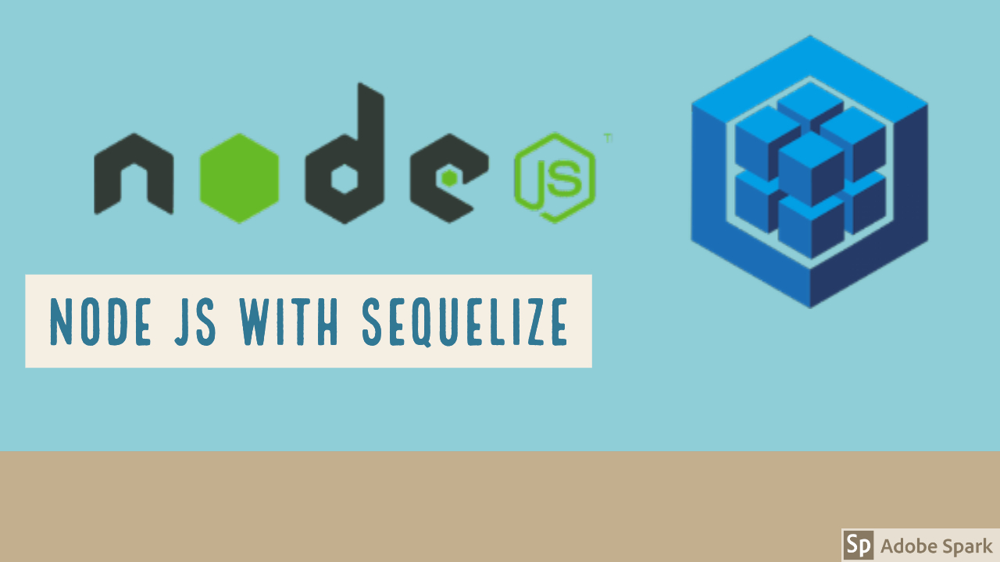
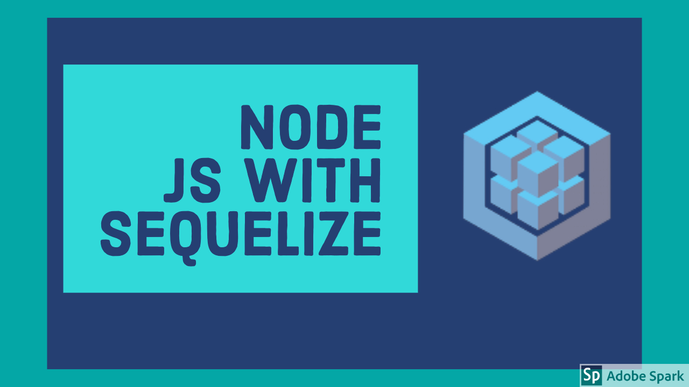

# Sequelize Tutorials

Sequelize is a promise-based Node.js ORM for Postgres, MySQL, MariaDB, SQLite and Microsoft SQL Server. It features solid transaction support, relations, eager and lazy loading, read replication and more.
## refernece links
- [Installation](http://docs.sequelizejs.com/)
- [Documentation](http://docs.sequelizejs.com/)

## Installation
```bash
$ npm install --save sequelize # This will install v5

# And one of the following:
$ npm install --save pg pg-hstore # Postgres
$ npm install --save mysql2
$ npm install --save mariadb
$ npm install --save sqlite3
$ npm install --save tedious # Microsoft SQL Server
```



## Documentation
- [v5 Documentation](http://docs.sequelizejs.com)
- [v4 Documentation](https://github.com/sequelize/sequelize/blob/v4/docs)
- [v3 Documentation](https://sequelize.readthedocs.io/en/v3/)
- [Contributing](https://github.com/sequelize/sequelize/blob/master/CONTRIBUTING.md)

## Responsible disclosure
If you have any security issue to report, contact project maintainers privately. You can find contact information in [CONTACT.md](https://github.com/sequelize/sequelize/blob/master/CONTACT.md).

## Resources
- [Changelog](https://github.com/sequelize/sequelize/releases)
- [Slack](http://sequelize-slack.herokuapp.com/)
- [Stack Overflow](https://stackoverflow.com/questions/tagged/sequelize.js)

### Tools
- [Sequelize & TypeScript](https://github.com/RobinBuschmann/sequelize-typescript)
- [Sequelize & GraphQL](https://github.com/mickhansen/graphql-sequelize)
- [Add-ons & Plugins](https://github.com/sequelize/sequelize/wiki/Add-ons-&-Plugins)
- [Sequelize CLI](https://github.com/sequelize/cli)

### Learning
- [Getting Started](http://docs.sequelizejs.com/manual/getting-started)
- [Express Example](https://github.com/sequelize/express-example)
